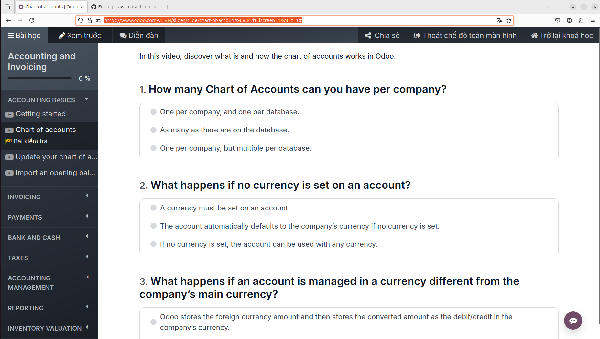
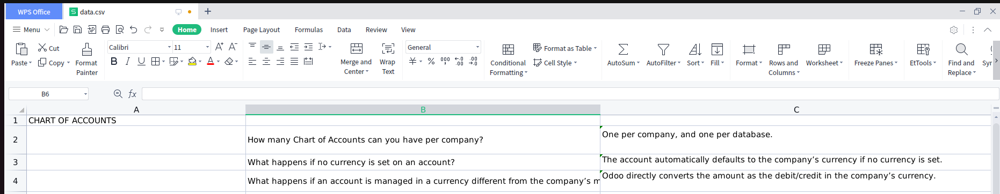
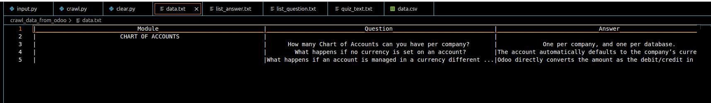
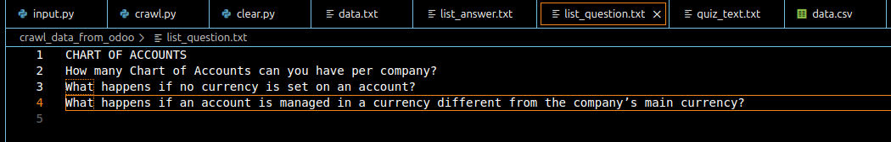
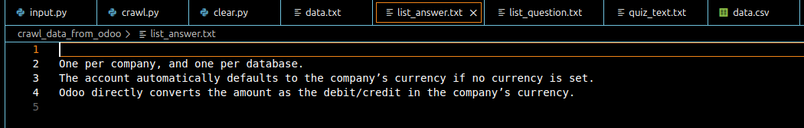
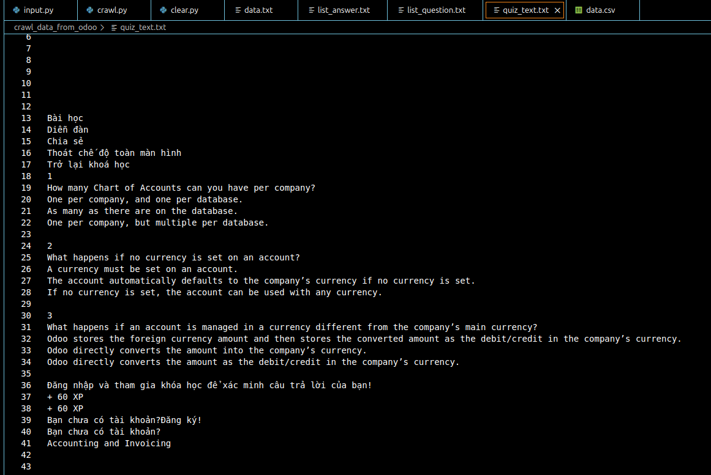

# crawl_data_from_odoo
MÔ TẢ: Mình sẽ thu thập dữ liệu từ trang quiz odoo và lưu vào một file txt, sau đó nhập đáp án và lưu kết quả vào file csv 
--------------------------------------------------------------------------------------------------------------------------
--------------------------------------------------------------------------------------------------------------------------
Yêu cầu: kết nối mạng ổn định, google chrome, python, pip và thư viện selenium

======================Set up python========================

https://code.visualstudio.com/docs/python/python-quick-start

================Cài đặt thư viện selenium==================
1. Mở Terminal và thực thi lệnh pip install selenium

===================Hướng dẫn sử dụng=======================
Bước 1: Chạy file crawl.py để thu thập dữ liệu từ trang quiz odoo gồm toàn bộ văn bản có trong trang này.
      1. Nhập đường dẫn tới trang quiz Odoo VD: https://www.odoo.com/vi_VN/slides/slide/chart-of-accounts-6834?fullscreen=1&quiz=1#
      2. Lưu ý: Đường dẫn này phải dẫn đến trang như hình sau: 
            
      3. Khi thực thi xong chương trình sẽ trả ra kết quả, nếu kết quả là "Success!!!" thì ta sẽ chuyển sang Bước 2. Ngược lại nếu kết quả được in ra màn hình là "Failure!!!" thì có thể là bạn đã nhập đường dẫn chưa đúng hoặc do kết nối mạng của bạn không ổn định không thể truy cập tới trang có đường dẫn ở trên.
Bước 2: Chạy file input.py để nhập kết quả và lưu vào file data.txt và data.csv.
      1. Nhập đường dẫn tới trang quiz như ở bước 1.
      2. Nhập đáp án. Ví dụ đáp án của bạn là 1A 2B 3C thì bạn chỉ cần nhập abc.
****Nếu đây là lần đầu bạn chạy các file trên thì máy sẽ tạo cho bạn các file sau:
  1. data.csv : file này để lưu dữ liệu của bạn dưới dạng bảng
            
  2. data.txt : file này để bạn kiểm tra dữ liệu đã được nhập vào file data.csv
            
  3. list_question.txt : danh sách câu hỏi và tên module đã thu thập được
            
  4. list_answer.txt : danh sách câu trả lời tương ứng với các dòng của file list_question.txt. VD: Câu hỏi của bạn ở dòng 4 trong file list_question.txt thì đáp án sẽ ở dòng 4 trong file list_answer.txt
            
  5. quiz_text.txt : toàn bộ dữ liệu dạng text có trong trang quiz của odoo
            
****Nếu đây không phải là lần đầu tiên bạn chạy các file trên thì các câu hỏi và đáp án sẽ được thêm vào cuối file data.csv và data.txt, các câu hỏi và đáp án vừa được thêm vào sẽ được lưu ở file list_question.txt và list_answer.txt

 Lưu ý: Nếu bạn muốn xóa dữ liệu của file data.txt và data.csv thì bạn hãy chạy file clear.py
